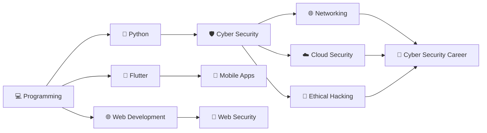

<div align="center">

# 👋 Hi, I'm Sehas Pathirana

### 🛡️ Cyber Security Undergraduate | 📱 Flutter & Android Developer | 🌐 Web Developer


<br><br>


</div>

---

## 👨‍💻 About Me

```yaml
name: Sehas Pathirana
role: Cyber Security Undergraduate

interests:
  - Cyber Security
  - Ethical Hacking
  - Mobile Development
  - Web Development
  - Cloud Computing
  - Networking

currently_learning:
  - Cyber Security
  - Python
  - Flutter
  - AWS
  - Networking

goal: Build secure, modern and useful technology.
```

- 🛡️ Cyber Security Undergraduate
- 📱 Flutter & Android Developer
- 🌐 Web & App Developer
- ☁️ Exploring AWS & Cloud Technologies
- 🔐 Interested in Ethical Hacking & Network Security
- 🐍 Learning Python and Cyber Security
- 🚀 Passionate about Mobile Innovation
- 🌱 Always learning new technologies

---

## 🛠️ Tech Stack

<div align="center">

### 💻 Programming


### 📱 Mobile Development


### 🌐 Web Development


### 🗄️ Database


### ☁️ Cloud


### 🔧 Tools


### 💻 Operating Systems


</div>

---

## 🛡️ Cyber Security

<div align="center">


</div>

---

## 🚀 Current Focus

```text
🛡️ Cyber Security       █████████████████░░░
📱 Flutter              ████████████████░░░░
🌐 Web Development      ███████████████░░░░░
🐍 Python               █████████████░░░░░░░
☁️ AWS Cloud            ████████████░░░░░░░░
🌐 Networking           █████████████░░░░░░░
```

---

## 📊 GitHub Statistics

<div align="center">


<br><br>


</div>

---

## 🏆 GitHub Trophies

<div align="center">


</div>

---

## 📈 Contribution Activity

<div align="center">


</div>

---

## 💎 Featured Project — Hidden Gems SL

> Discover the hidden beauty of Sri Lanka.

📱 Mobile Application • 🗺️ Location Discovery • 🛡️ Security Focused • 🚀 Modern Mobile Experience

**Technologies:** `Flutter` • `Dart` • `Mobile Development` • `Security` • `Location Services`

---

## 🧠 My Learning Journey



---

## 🎯 Areas of Interest

| 🛡️ Cyber Security | 📱 Development | ☁️ Cloud & Tech |
|:---:|:---:|:---:|
| Ethical Hacking | Flutter | AWS |
| Network Security | Android | Cloud Computing |
| Web Security | Python | Networking |
| Linux Security | C / C++ | Git & GitHub |
| Cloud Security | Web Development | Mobile Technology |

---

## 💡 My Philosophy

<div align="center">

### `LEARN → BUILD → TEST → SECURE → IMPROVE 🚀`

**Building technology while learning how to protect it.**

</div>

---

## 📫 Connect With Me

<div align="center">

<a href="mailto:pathiranasehas3@gmail.com">

</a>

<a href="https://github.com/Sesss123">

</a>

</div>

---

<div align="center">

## 👨‍💻 Thanks for visiting!

### 🛡️ Secure • 💻 Build • 📚 Learn • 🚀 Repeat


</div>
